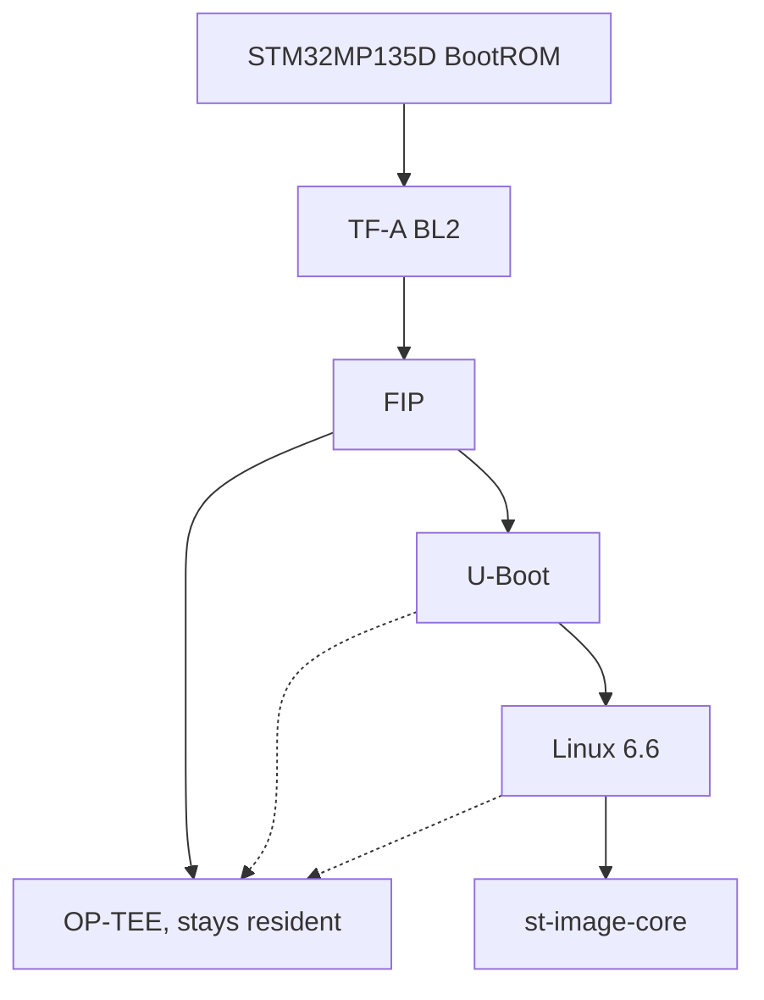

# ODYSSEY STM32MP135D Yocto BSP

Board support for the Seeed Studio ODYSSEY STM32MP135D on OpenSTLinux
v6.2.1 / Yocto Scarthgap. The layer in this repository is `meta-odyssey`:
the machine configuration, the board device trees, and two bbappends.
`scripts/setup.sh` fetches OpenSTLinux. Those upstream trees are not in git.

v0.1.0 boots Linux from SD. The checks that passed, and the ones that did
not run, are in [docs/hardware.md](docs/hardware.md).

## Board

Seeed Studio ODYSSEY STM32MP135D (STM32MP135D, one Cortex-A7, 512 MiB
DDR3L). Machine name `odyssey-stm32mp135d`.

SD is the only boot device in `BOOTDEVICE_LABELS`. eMMC is described and
was detected; it is not a boot path in this release. LCD, backlight,
touch, Qt, Weston as a product image, Web HMI, and Modbus are not included.

## Versions

| Item | Value |
| --- | --- |
| OpenSTLinux | v6.2.1 |
| Manifest tag | `openstlinux-6.6-yocto-scarthgap-mpu-v26.06.10` |
| Manifest commit | `71e658b9a8cff67bef0f53a3543dad19d61380f2` |
| Yocto | 5.0.17 Scarthgap |
| BitBake | 2.8.1 |
| Kernel | Linux 6.6.129-stm32mp-r3.1 |
| TF-A | v2.10.24-stm32mp-r3.1 |
| U-Boot | v2023.10-stm32mp-r3.1 |
| OP-TEE | 4.0.0-stm32mp-r3.1 |
| Distro | `openstlinux-weston` |
| Image | `st-image-core` |

`setup.sh` refuses a checkout that does not match
`scripts/layer-revisions.txt`. The same pins are in
[manifests/openstlinux-6.2.1.md](manifests/openstlinux-6.2.1.md).

## Repository

```text
meta-odyssey/     machine, device trees, bbappends
scripts/          setup, build, SD image, flash
manifests/        pinned OpenSTLinux revisions
docs/             build and hardware notes
```

Collection `odyssey`, layer priority 8. Do not add a second layer that
also ships `odyssey-stm32mp135d.conf`.

## Quick start

Packages, the AppArmor sysctl, and the ST EULA variable are in
[docs/build.md](docs/build.md).

```bash
./scripts/setup.sh
./scripts/build.sh
./scripts/create-sdcard.sh
```

Those three commands only write files, including
`stm32mp135d-odyssey-sdcard.raw`. They do not write a block device.
Flashing is a separate step in [docs/build.md](docs/build.md).

## Boot chain

TF-A BL2 is the FSBL. It loads a FIP that contains OP-TEE and U-Boot.
OP-TEE stays resident in secure world. U-Boot and Linux run in non-secure
world and call it. OP-TEE does not exit when U-Boot starts.



DDR timings come from ST's `stm32mp13-ddr3-1x4Gb-1066-binF.dtsi`. This
layer does not replace that file and does not program OTP. Pinmux, secure
GPIO, regulators, and the two watchdogs are in
[docs/hardware.md](docs/hardware.md).

## Validated

On the SD card built from this tree: Linux boots, `/dev/ttySTM0` works,
the root filesystem is mounted, `end0` and `end1` show link up, eMMC
enumerates, and the USB host controllers enumerate. Ethernet traffic, USB
mass storage, suspend/resume, and eMMC boot were not tested. See
[docs/hardware.md](docs/hardware.md).

## License

Files written here are MIT: [LICENSE](LICENSE), also
`meta-odyssey/COPYING.MIT`. That covers the layer configuration, the
bbappends, the scripts, and these docs. It does not cover OpenSTLinux or
the board device trees. Leave the SPDX lines in those trees as they are.

| File | SPDX-License-Identifier |
| --- | --- |
| `tf-a/stm32mp135d-odyssey.dts` | `(GPL-2.0+ OR BSD-3-Clause)` |
| `tf-a/stm32mp135d-odyssey-fw-config.dts` | `(GPL-2.0+ OR BSD-3-Clause)` |
| `optee/stm32mp135d-odyssey.dts` | `(GPL-2.0+ OR BSD-3-Clause)` |
| `u-boot/stm32mp135d-odyssey.dts` | `(GPL-2.0+ OR BSD-3-Clause)` |
| `linux/stm32mp135d-odyssey.dts` | `(GPL-2.0+ OR BSD-3-Clause)` |
| `u-boot/stm32mp135d-odyssey-u-boot.dtsi` | `GPL-2.0-or-later OR BSD-3-Clause` |

`GPL-2.0+` was not rewritten to `GPL-2.0-or-later`. The headers name ST
`stm32mp135f-dk` and the Seeed Studio / xogium trees
`v2.8-stm32mp-odyssey-r1` (TF-A) and `v6.1-stm32mp-odyssey-r4` (Linux).
Those checkouts are not vendored.

OpenSTLinux keeps its own licenses, including the ST EULA that
`envsetup.sh` records. How to set that variable is in
[docs/build.md](docs/build.md). This repository does not accept the EULA
for you.
