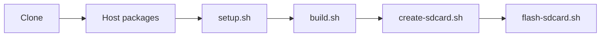

# Build

`./scripts/setup.sh` fetches OpenSTLinux into `sources/`. A clone does not
need a pre-filled `downloads/` or `sstate-cache/`.

## Host

Tested on Ubuntu 24.04. The scripts also accept Ubuntu 22.04. They check
packages with `dpkg` and do not install them.

Ubuntu 24.04, the OpenSTLinux `Ubuntu_24.04` list:

```text
gawk wget git diffstat unzip texinfo gcc-multilib
build-essential chrpath socat cpio python3 python3-pip python3-pexpect
xz-utils debianutils iputils-ping python3-git python3-jinja2 libsdl1.2-dev
pylint xterm bsdmainutils
libssl-dev libgmp-dev libmpc-dev
lz4 zstd git-lfs libusb-1.0-0
```

Ubuntu 22.04 is the same list plus `libegl1-mesa`.

Also required: `curl`, `gpg`, and `git` `user.name` / `user.email`. If
`repo` is not on `PATH`, `setup.sh` downloads it to `scripts/.repo-tool/`.
`create-sdcard.sh` needs `sgdisk` (`gdisk`). `flash-sdcard.sh` needs
`lsblk` and `findmnt`.

BitBake 2.8.1 uses `unshare`. With
`kernel.apparmor_restrict_unprivileged_userns=1`, it stops:

```text
User namespaces are not usable by BitBake, possibly due to AppArmor
```

`setup.sh` and `build.sh` exit in that case. They do not change the
sysctl. A reboot can set it back to `1`. To allow BitBake until the next
reboot:

```bash
sudo sysctl -w kernel.apparmor_restrict_unprivileged_userns=0
```

Skip that if you do not want the restriction lifted.

### Machine size

The host that produced the v0.1.0 image had about 17 GiB under `sources/`
(including the build directory), 6.0 GiB in `downloads/`, and 4.2 GiB in
`sstate-cache/`. The SD raw image itself is 5153751040 bytes. A first
build needs network access for `repo sync` and the recipe downloads.

Peak RAM and a minimum disk size were not measured. Do not treat the
figures above as a requirement.

## Workflow

`setup.sh`, `build.sh`, and `create-sdcard.sh` write files only.
`flash-sdcard.sh` is the step that writes a block device.



## Setup

| Item | Value |
| --- | --- |
| Manifest | `https://github.com/STMicroelectronics/oe-manifest.git` |
| Tag | `openstlinux-6.6-yocto-scarthgap-mpu-v26.06.10` |
| Manifest commit | `71e658b9a8cff67bef0f53a3543dad19d61380f2` |
| Distro | `openstlinux-weston` |
| Machine | `odyssey-stm32mp135d` |
| Image | `st-image-core` |

```bash
./scripts/setup.sh
```

`setup.sh` runs `repo init` on that tag, `repo sync`, and checks
`scripts/layer-revisions.txt`. An existing `sources/` tree on another tag
is left unchanged and the script stops.

Build directory:
`sources/build-openstlinuxweston-odyssey-stm32mp135d`, also linked as
`build/`. `downloads/` and `sstate-cache/` are created beside the
repository if they are missing. All three are gitignored.

The script links `sources/layers/meta-odyssey` and writes a machine stub
into the fetched `meta-st` tree, because `envsetup.sh` looks there for the
machine name. BitBake loads the real file from `meta-odyssey` (priority 8).
`build.sh` stops if `meta-patvaz` is on `BBLAYERS`.

## EULA

`setup.sh` exports `EULA_odysseystm32mp135d` when it is unset. The default
in `scripts/pins.env` is `0`. OpenSTLinux `envsetup.sh` then stores that
value as `ACCEPT_EULA_odyssey-stm32mp135d` and does not prompt.

| Value | Meaning |
| --- | --- |
| `0` | ST EULA not accepted. |
| `1` | ST EULA accepted. |

The image that was flashed was built with `0`
(`ACCEPT_EULA_odyssey-stm32mp135d = "0"`). `st-image-core` for this
machine completed with that setting. This machine does not enable the
`gpu` feature. The ST GPU userland recipe (`gcnano-userland`) refuses to
unpack unless the value is `1`; that recipe is not part of the tested image.

This repository never sets the variable to `1`. To accept the EULA
yourself, export it before setup:

```bash
export EULA_odysseystm32mp135d=1
./scripts/setup.sh
```

If you leave the variable unset and bypass `setup.sh`, `envsetup.sh` asks
on the console instead.

## Image

```bash
./scripts/build.sh
./scripts/create-sdcard.sh
```

`build.sh` parses, checks the layers, and runs `bitbake st-image-core`.
Log: `logs/st-image-core.log`.

Deploy directory:

`build/tmp-glibc/deploy/images/odyssey-stm32mp135d/`

`create-sdcard.sh` calls ST `create_sdcard_from_flashlayout.sh` on
`flashlayout_st-image-core/optee/FlashLayout_sdcard_stm32mp135d-odyssey-optee.tsv`.
It does not set `DEVICE`. Default output:

`build/tmp-glibc/deploy/images/odyssey-stm32mp135d/stm32mp135d-odyssey-sdcard.raw`

```bash
./scripts/create-sdcard.sh --output /path/to/image.raw
```

The card that booted used that default file: 5153751040 bytes, SHA256
`005c9c0e5542591504c9a667cbde519a9e58fdda2edcd5270537fdcee992f47f`.
Boot results are in [hardware.md](hardware.md).

## Flashing

Only `scripts/flash-sdcard.sh` writes a card. The other scripts do not call
it. It does not run `fuse prog` or `fuse override`, and it does not target
eMMC.

```bash
./scripts/flash-sdcard.sh /path/to/image.raw /dev/sdX
```

Before `dd`, the script:

1. Requires both arguments. There is no default device.
2. Requires a non-empty regular file and a block device.
3. Requires `lsblk` and `findmnt`.
4. Prints `lsblk` (name, type, size, removable flag, read-only flag, model, mount points).
5. Rejects anything whose type is not `disk`, including partitions.
6. Rejects a device whose removable flag is not `1`.
7. Rejects a device that still has a mount point.
8. Rejects the disk that holds `/`, and rejects the root filesystem device itself.
9. Requires an interactive terminal. It prints the canonical destination path and continues only if you type that path back.
10. Stops if that path is not writable.

Then it runs:

```text
dd if=<image> of=<canonical-device> bs=8M conv=fdatasync status=progress
```

After the write, the script prints a hint. It does not run `sgdisk` itself.
If `sgdisk -v` reports a problem because the card is larger than the image,
`sgdisk -e <device>` moves the backup GPT to the end of the card. It does
not change partition contents. Confirm the device again before you run it.

Console is UART4, 115200 8N1, `/dev/ttySTM0`.
